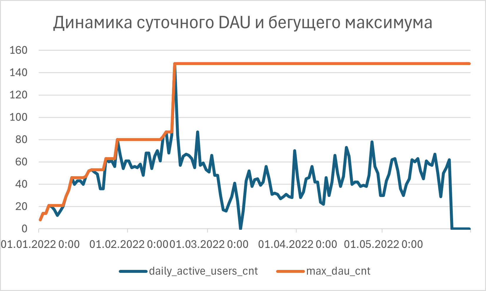

# Продуктовая аналитика: Расчет и анализ динамики DAU (PostgreSQL)

Практический кейс по расчету суточной активности пользователей (Daily Active Users) и отслеживанию просадок от бегущего максимума за 150 дней.

## 📌 Бизнес-задача
Спроектировать запрос для вычисления ежедневного DAU на платформе. 
**Ключевая проблема данных:** В логах входов (`userentry`) отсутствуют записи за дни с нулевой активностью. Обычный `GROUP BY` опустил бы такие даты и исказил временной ряд.

## 🛠 Используемый стек и методы
* **PostgreSQL**
* **`generate_series`** — генерация непрерывного временного календаря.
* **`CTE`** — логическое разделение на подготовку сетки дат и расчет метрик.
* **`RIGHT JOIN`** — удержание дат с нулевым присутствием пользователей.
* **`MAX() OVER(...)`** — расчет бегущего максимума и динамической просадки (`diff_dau`).

## 📂 Структура проекта
* `solution.sql` — рабочий SQL-запрос с комментариями.
* `schema.sql` — скрипт создания тестовой структуры данных.

## 📊 Пример итогового вывода
| date_from_calendar | daily_active_users_cnt | max_dau_cnt | diff_dau |
| :--- | :--- | :--- | :--- |
| 2022-01-01 | 142 | 142 | 0 |
| 2022-01-02 | 0 | 142 | -142 |
| 2022-01-03 | 210 | 210 | 0 |
## Пример работы запроса на основе данных

